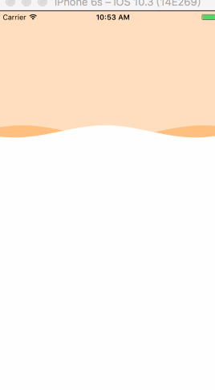
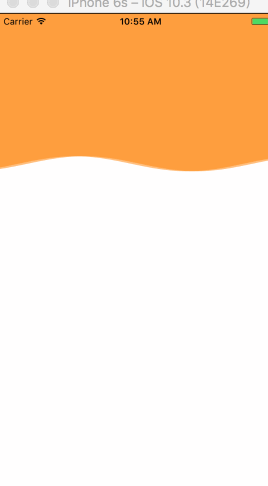
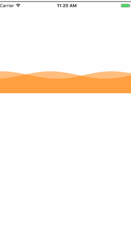

# waveNavigitaion
waveNavigition demo.Use to custom navigtion


- 样式一


```
//    样式一：底部是波浪，上面是横线
    v.speed = 2;
    v.waveW = 375;
    v.waveH = 10;
    v.fillColor1 = [UIColor orangeColor];
    v.fillColor2 = [UIColor whiteColor];


```



- 样式二

```
//样式二：底部是波浪，上面是横线.有深有浅
    v.speed = 2;
    v.waveW = 375;
    v.waveH = 10;
    v.fillColor1 = [UIColor orangeColor];
    v.fillColor2 = [UIColor orangeColor];


```




- 样式三

```
//样式三：   底部是横线，上面是波浪
    v.speed = 2;
    v.waveW = 375;
    //    底部是横线，上面是波浪
    v.startEndY = 250;
    v.waveH = 10;
    v.fillColor1 = [UIColor orangeColor];
    v.fillColor2 = [UIColor orangeColor];
```


